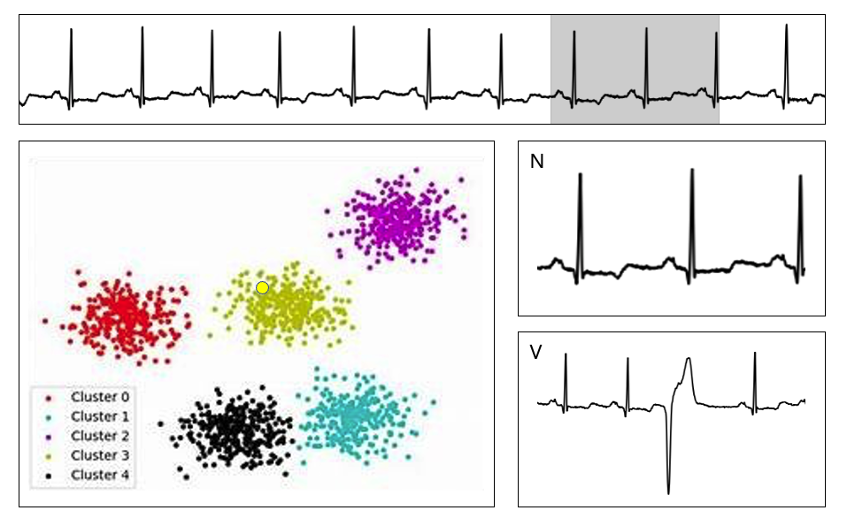

# Arrhythmia Classification pyqt
PYQT를 사용한 부정맥 분류 시제품 개발

## 목적 
실시간 입력 데이터를 분석하기 위한 과정을 시각화 하며 앞으로의 서비스 적용, 신경망 디버깅 등 전반적인 AI 작업 흐름을 시각화 함.

## 사용법
```sh
$ pip install -r requirements.txt
$ python main.py
```
P.S.) 윈도우, 리눅스 등에서 사용가능한 (.exe, .run 등) 확장자로 변환 예정

## 구성
### 데이터 입력
- 실시간 심전도 흐름 표시(상단)
  * ECG 10분 데이터 xlsx 파일을 읽어들여 순차적 진행
  * 회색 영역으로 들어온 데이터를 일정 시간별로 스캔하여 분석에 사용

- 군집화 시각화 (좌)
  * 데이터셋의 클래스 라벨에 따라 군집화된 영역을 표시
  * 스캔된 데이터의 분석 결과를 해당 플롯에 추가 후 추가된 영역을 표시

- 스캔된 데이터 및 라벨 (우)
  * 상하 두개의 영역으로 나누며 스캔된 결과 제공
  * 상단) 실시간 스캔 결과를 데이터 분석 결과와 같이 제공
  * 하단) 부정맥으로 분류된 파형의 가장 최근 데이터 제공

## 구성도
<div align="center">
  
</div>

